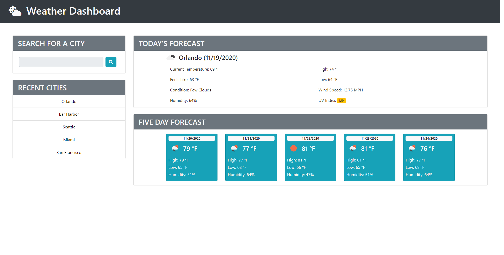

# Weather Dashboard
# Purpose 
A simple weather application that will display current weather information as well as a five-day forecast for the user-selected city.

## Contents
1. [Features](#features)
2. [Built With](#built-with)
3. [Web Page](#web-page)
4. [Task List](#task-list)
5. [Contribution](#contributions)

## Features
* Users can look up current and five-day forecasts by searching for a city.
* UV index will display with a green, yellow, red, or purple badge dependant on severity.
* Up to five of the most recent search results are saved.
* Duplicate search results will not be saved.
* Application is media query responsive.

## Built With
* HTML5
* JavaScript
* BootStrap 4
* Moment.js
* CSS3

## Web Page

[Deployed Weather Dashboard](https://deckiedevs.github.io/weather-dashboard)

## Task List
- [ ] Refactor
- [x] Submit form on `ENTER` key.
- [ ] Add feature: search by zip code.
- [ ] Add feature: search by city and state. 

## Contributions
* Weather APIs and forecast icons provided by [OpenWeather](https://openweathermap.org/).
* Header icon provided by [Font Awesome](https://fontawesome.com/).
* Favicon provided by [Favicon.io](https://favicon.io/).
* Created with much excitement by Mila Decker.